# MY_CV
My CV note.

```
>> im = imread('perpers.png');
>> imgreen = im(:,:,2); %matlab index start at 1. so green channel is 2.
>> imshow(imgreen)
>> line([1 512],[256 256],'color','r');
>> plot(imgreen(256,:));
>> disp(size(im));
>> disp(class(im)); %uint8
>> 
```

Multiply by a scal function
函数的写法

```
function result = scal(img, value)
	result = value .* img;
endfunction
```

产生Gaussian noise

```
noise = randn([1, 100]);
[n, x] = hist(noise, [-3, -2, -1, 0, 1, 2, 3]);
```
`n`是数量，x是bin。

```
disp([x; n]);

 	-3    -2    -1    0     1      2     3
    1     4    27    35    26     6     1
```

```
noise = randn([1, 10000])
[n, x] = hist(noise, linspace(-3, 3, 21));
plot(x, n);
```
`randn`-> Standard Normal Distribution

`rand` -> uniform distribution

`randi`-> random integers


##3 Effect of sigma on Gaussian Noise
`noise = randn(size(im))*sigma;`

## Lession 2A-L2 Filtering
### Gaussion Noise
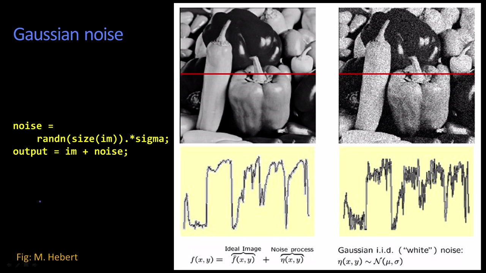

*adding a noise function to an image function*

```
noise = randn(size(im)).*sigma;
output = im + noise;
```
output was just the image + noise
worry to the range of the image:
image [0 255] sigma=5 should plausible, if image [0 1] that is not plausible.

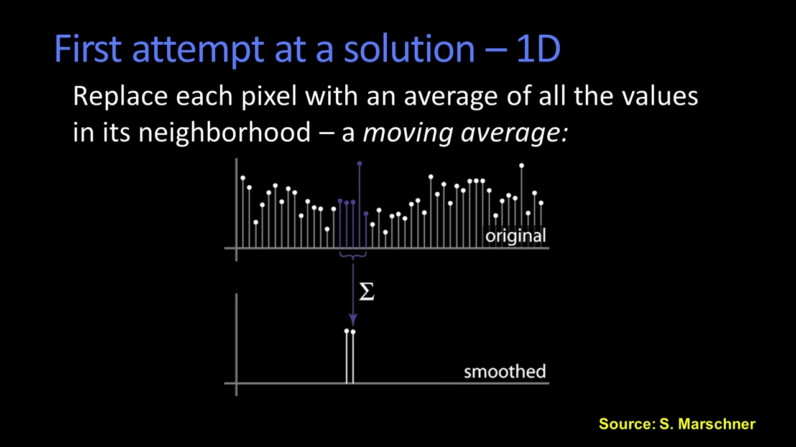

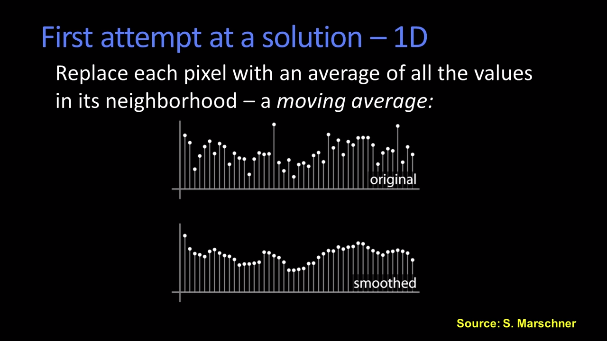

replace each pixel with an average of the values of the pixels neighborhood, this is referred to as a moving average. 最终得到smooth后的结果。

### Averaing Assumptions
**1 The "true" value of pixels are similar to the true value of pixels nearby.**

**2 The noise added to each pixel is done independently.**

### Weighted Moving Average
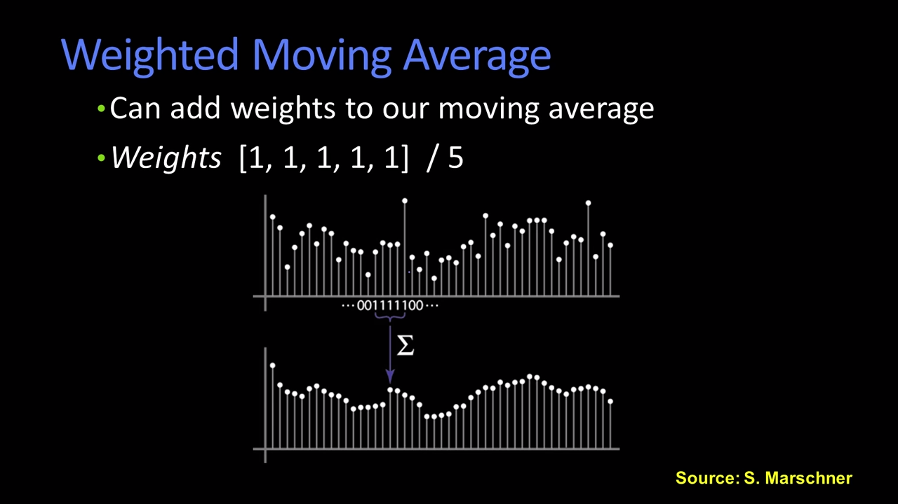


non-uniform weight 与数值相邻近。

To do the moving average conputation the num of weights should be **Symmetric and Odd-makes it easier to have a middle pixel**.

### Moving Average In 2D
image - 2D

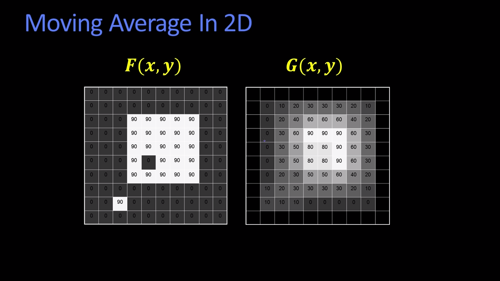

### Correlation Filtering
save the averaging window size is $(2k + 1)\times(2k + 1)$.
$G[i, j] = \frac{1}{(2k+1)^2}\sum_{u = -k}^{k}\sum_{v = -k}^{k}F[i+u,j+v]$

$\frac{1}{(2k+1)^2}$-->Uniform weight for each pixel.

$\sum_{u = -k}^{k}\sum_{v = -k}^{k}F[i+u,j+v]$-->loop over all pixels in neighborhood around image pixel $F[i,j]$.

**Correlation filtering - non-uniform weights**

Now generalize to allow different weights depending on neighboring pixel's relative position:
$G[i,j] = \sum_{u=-k}^{k}\sum_{v = -k}^{k}H[u,v]F[i+u,j+v]$
This is called **cross-correlation**, denoted $G = H\otimes F$.

$H[u,v]$--> None-uniform weights
The filter "**kernel**" or "**mask**" $H[u,v]$ is the matrix of weights in the linear combination.

### Averaging Filter

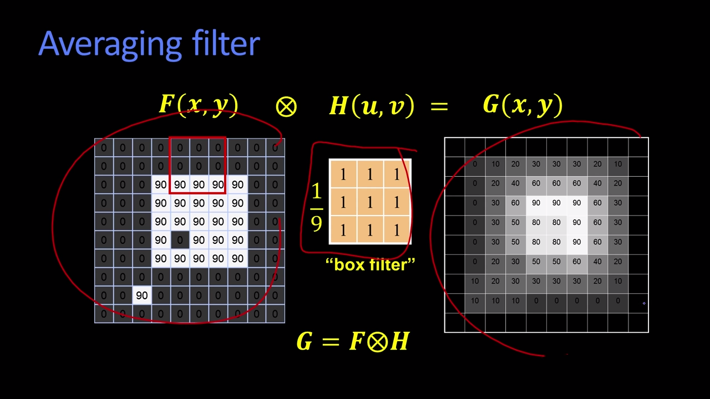
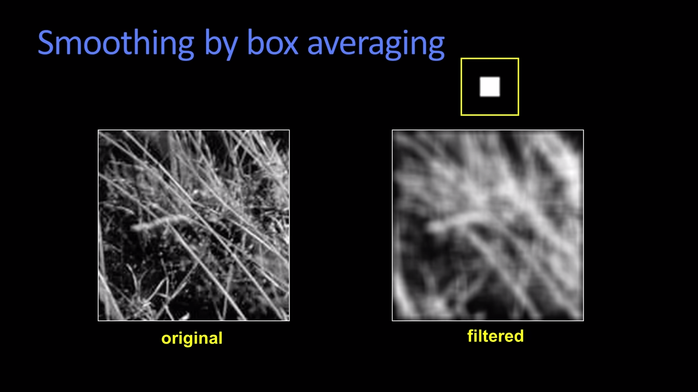

**what went wrong with the output?**

squares are not smooth, filters are blurring of filtering an image to make it smoother doesn't seem right.

To blur a signle pixel into a "blurry" spot, we would need to need to filter the spot with a something that look like a blurry spot - higher values in the middle, falling off to the edges.

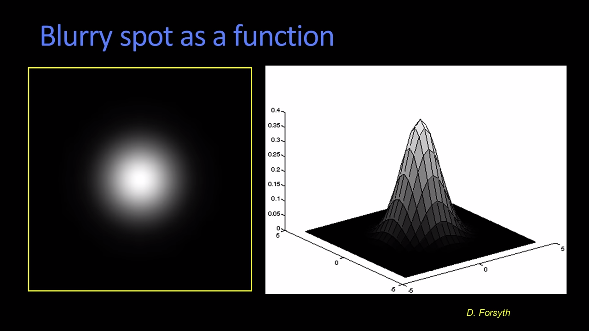

### Gaussian Filter

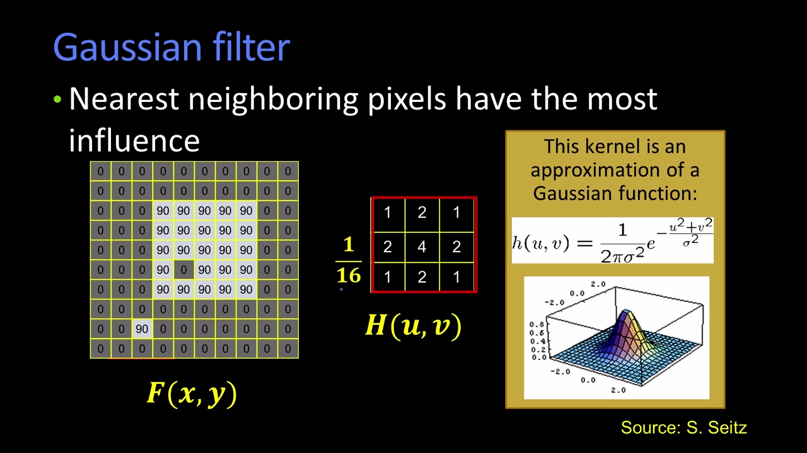
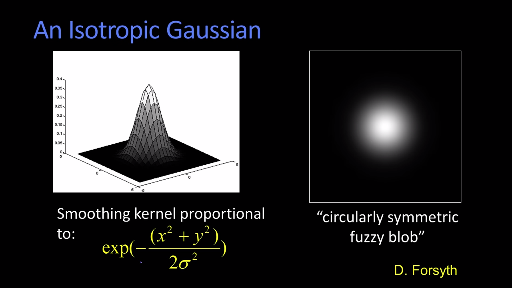

#### Compare with Gaussian and non-Gaussian
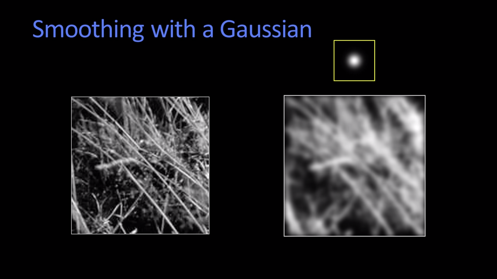
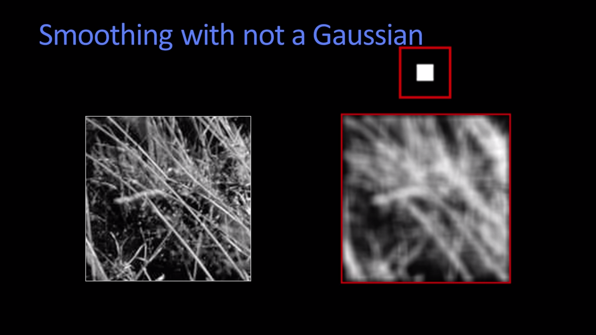

non-Gaussian filter you can see those shape edges.

Gaussian filters are referred to as exponentials. The complete formular is:
**$h(u, v) = \frac{1}{2\pi\sigma^2}exp(-\frac{x^2+y^2}{2\sigma^2})$**

### Variance or Standard Deviation
The Gaussian we just talked about is what's referred to as isotropic(各向同性) and it basically had 1 parameter $\sigma$, the bigger the more blur.
the filter:
the size of matrix $(3\times 3)$,$(5\times 5)$,$(11\times 11)$.

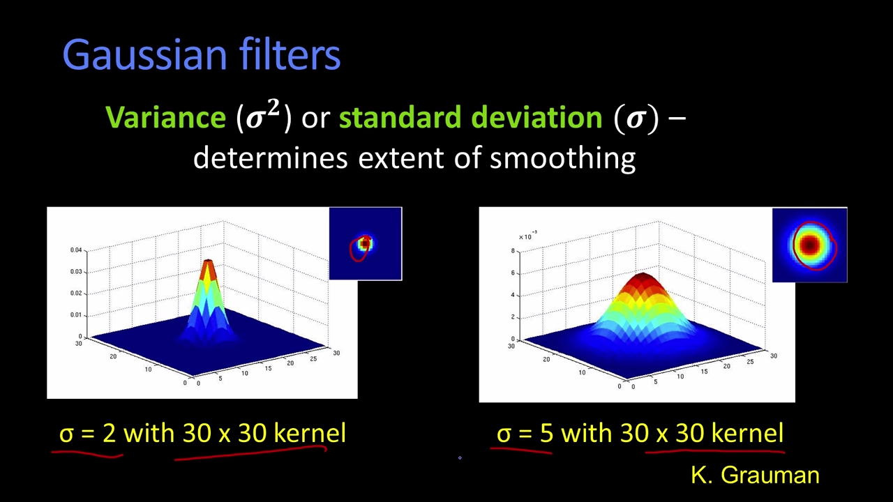
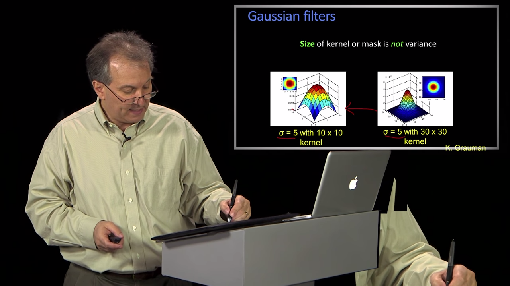
The bigger kernel, it's smoother, it's going to work better.->actually mean a bigger $\sigma$. That's what you care about is the size of the sigma, not actual kernel.

### Matlab
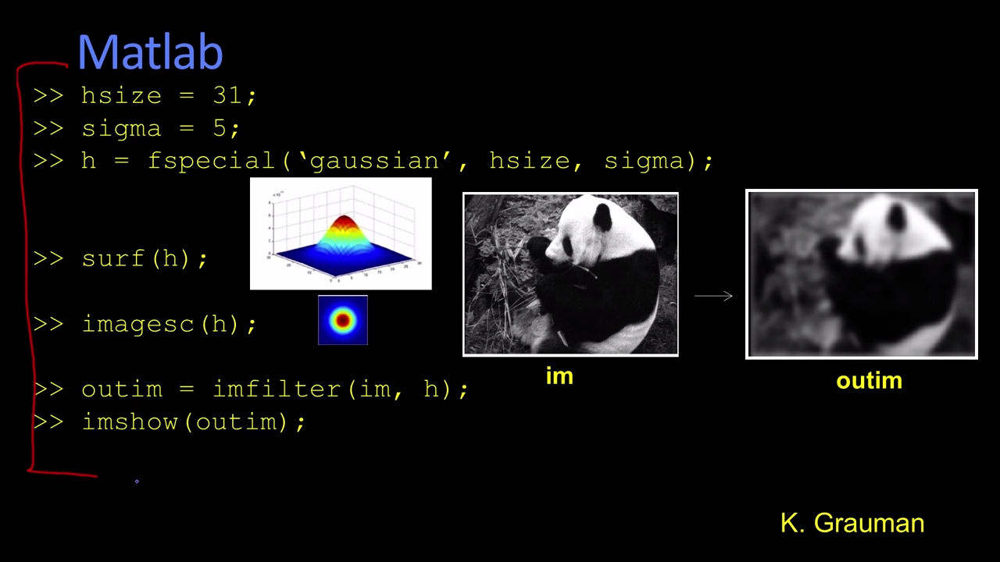
MATLAB 用surf函数画出来的图 叫surf 三维着色表面图、三维表面图、表面图。imagesc(A)将矩阵A中的元素数值按大小转化为不同颜色，并在坐标轴对应位置处以这种颜色染色。
`surf()` --> surface; `imagesc()` --> show image

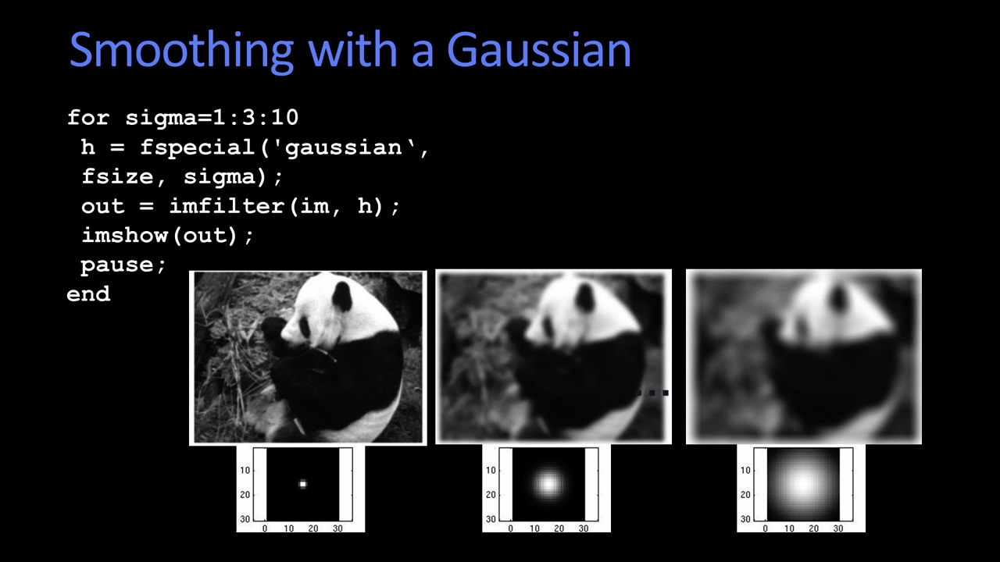

### Remove Noise


